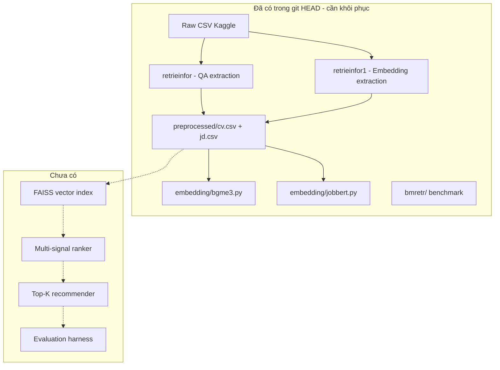
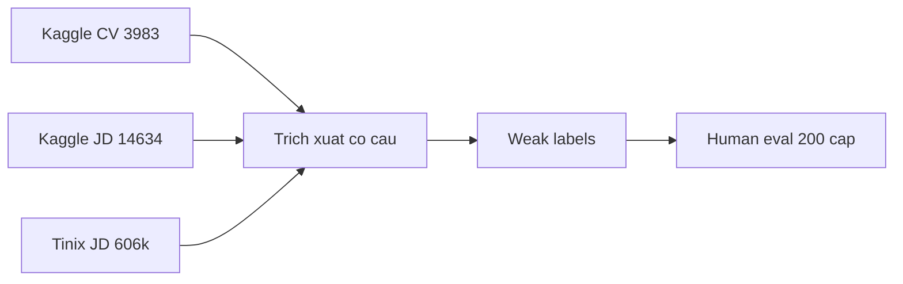
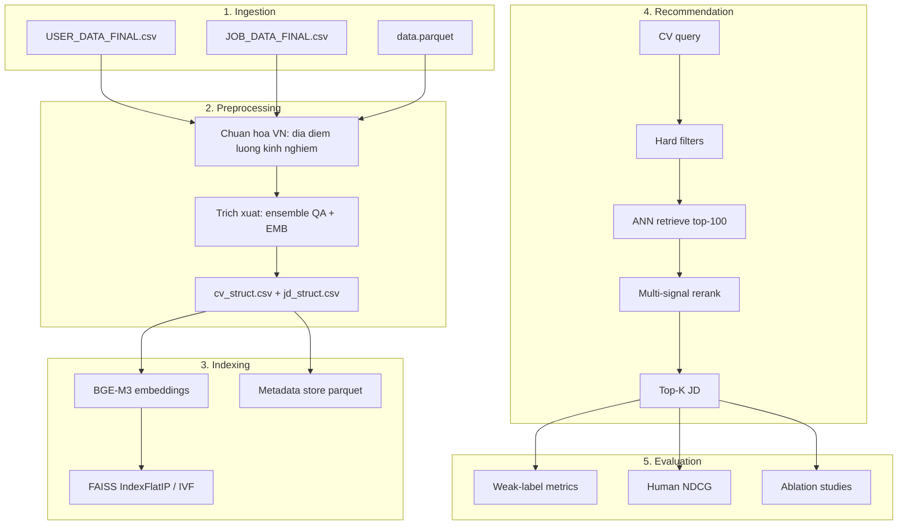

# Thiết kế & Kế hoạch: Hệ thống Gợi ý Việc làm CV → JD (Tiếng Việt)

> **Dự án:** jdcvcnsfinal  
> **Ngày:** 2026-07-21  
> **Phạm vi:** Gợi ý việc làm cho ứng viên (CV → JD), pipeline nghiên cứu/ML

---

## 1. Mục tiêu & Phạm vi

**Mục tiêu:** Với một hồ sơ ứng viên (CV), hệ thống trả về top-K tin tuyển dụng (JD) phù hợp nhất, xếp hạng theo độ tương đồng đa chiều.

**Phạm vi (đã xác nhận):**

- Hướng **CV → JD** (gợi ý việc làm cho ứng viên)
- Giai đoạn **nghiên cứu / ML pipeline** — chưa cần API hay giao diện web
- Tài liệu lưu tại `docs/`

**Tiêu chí thành công:**

- Pipeline end-to-end chạy được: raw CSV → trích xuất → embedding/index → top-K JD cho mỗi CV
- Đánh giá định lượng trên tập validation (weak labels + human eval mẫu)
- Precision@10 và NDCG@10 vượt baseline TF-IDF và embedding đơn trường

---

## 2. Hiện trạng dự án



**Lưu ý quan trọng:** Toàn bộ mã nguồn tùy chỉnh (`retrieinfor/`, `retrieinfor1/`, `embedding/`, `bmretr/`) đang bị **xóa khỏi working tree** nhưng còn trong git HEAD. Bước đầu tiên khi triển khai:

```bash
git checkout HEAD -- retrieinfor retrieinfor1 embedding bmretr phase1
```

**Kết quả benchmark trích xuất hiện tại** (10 bản ghi gold, `bmretr/result/result2/`):

- CV: Embedding F1 = 0.636, QA F1 = 0.575
- JD: QA F1 = 0.477, Embedding F1 = 0.490

**Thư viện Microsoft Recommenders** (`recommenders/`) là thư viện tổng quát (phim, tin tức) — **không tích hợp** với dữ liệu JD-CV. Chỉ dùng làm baseline TF-IDF tham khảo nếu cần; không phụ thuộc vào nó.

---

## 3. Dữ liệu (Datasets tiếng Việt)

### 3.1 Dataset chính — Kaggle Job Dataset (có cặp CV + JD)

| File | Bản ghi | Nguồn | Vai trò |
|------|---------|-------|---------|
| `dataset/job-dataset-for-recommendation/USER_DATA_FINAL.csv` | 3.983 CV | TimViec365 | Query (ứng viên) |
| `dataset/job-dataset-for-recommendation/JOB_DATA_FINAL.csv` | 14.634 JD | TopCV | Candidate pool (giai đoạn 1) |

**Trường CV quan trọng:** `UserID`, `Industry`, `Desired Job`, `Workplace Desired`, `Desired Salary`, `Skills`, `Degree`, `Work Experience`, `Target` (tóm tắt)

**Trường JD quan trọng:** `JobID`, `Job Title`, `Job Description`, `Job Requirements`, `Job Address`, `Salary`, `Years of Experience`, `Industry`, `Career Level`

**Hạn chế:** Không có nhãn tương tác thực (ứng tuyển, click, tuyển dụng). Phải dùng **weak supervision** (xem mục 6).

### 3.2 Dataset mở rộng — Tinix Vietnam Job Descriptions

| File | Bản ghi | Vai trò |
|------|---------|---------|
| `dataset/vietnamese-job-descriptions/data.parquet` | 606.878 JD | Mở rộng kho việc làm (giai đoạn 2) |

**Nguồn:** Hugging Face `tinixai/vietnamese-job-descriptions` (CC BY-NC 4.0)

**Không có CV đi kèm** — chỉ dùng làm corpus JD bổ sung, không dùng để huấn luyện có giám sát trực tiếp.

### 3.3 Chiến lược dữ liệu



- **Giai đoạn 1:** Chỉ Kaggle (14.634 JD) — đủ để prototype và đánh giá
- **Giai đoạn 2:** Thêm Tinix → FAISS index ~620k JD
- **Weak labels:** Tạo positive/negative từ khớp `Industry`, `Desired Job` ≈ `Job Title`, `Workplace Desired` ≈ `Job Address`
- **Human eval:** Gán nhãn relevance 0/1/2 cho 200 cặp CV-JD ngẫu nhiên (ước tính 4-8 giờ)

---

## 4. Ba phương án tiếp cận

### Phương án A — Embedding đơn giản (baseline nhanh)

- Dùng `BAAI/bge-m3` embed toàn bộ CV profile và JD profile
- Cosine similarity → top-K
- **Ưu:** Triển khai nhanh, tận dụng `embedding/bgme3.py` hiện có
- **Nhược:** Bỏ qua filter cứng (địa điểm, lương, kinh nghiệm); chất lượng trích xuất thấp ảnh hưởng lớn

### Phương án B — Hybrid: Filter cứng + Embedding đa trường (khuyến nghị)

- **Bước 1 — Hard filter:** Loại JD không khớp địa điểm, ngành (nếu có), mức lương (overlap), kinh nghiệm
- **Bước 2 — Soft score:** Trọng số hóa similarity theo từng cặp trường:

| Cặp trường | Trọng số đề xuất |
|------------|------------------|
| CV skills ↔ JD required_skills | 0.35 |
| CV summary + experience ↔ JD description | 0.25 |
| CV desired_job ↔ JD job_title | 0.20 |
| CV education ↔ JD requirements | 0.10 |
| CV industry ↔ JD industry | 0.10 |

- **Bước 3 — FAISS index** trên JD embeddings để retrieve nhanh
- **Ưu:** Cân bằng chính xác và khả năng giải thích; phù hợp dữ liệu không có nhãn
- **Nhược:** Cần chuẩn hóa trường (lương VN, địa điểm, kinh nghiệm)

### Phương án C — Learning-to-Rank với weak labels

- Tạo feature vector từ Phương án B + metadata
- Huấn luyện LightGBM/XGBoost ranker trên weak labels
- **Ưu:** Tối ưu thứ hạng tốt hơn khi có đủ weak labels
- **Nhược:** Phức tạp hơn; cần validation kỹ để tránh overfit weak labels

**Khuyến nghị:** Bắt đầu **Phương án B**, sau đó nâng cấp lên **C** nếu weak-label eval cho thấy cải thiện.

---

## 5. Kiến trúc hệ thống đề xuất



### 5.1 Cấu trúc thư mục

```
jdcvcnsfinal/
├── docs/
│   └── plan.md                   # Tài liệu này
├── recommend/                    # Module gợi ý mới
│   ├── __init__.py
│   ├── config.py                 # Trọng số, đường dẫn, hyperparams
│   ├── normalize/                # Chuẩn hóa tiếng Việt
│   │   ├── location.py           # Hà Nội, HCM, Đà Nẵng...
│   │   ├── salary.py             # Parse "5-10 triệu", "thỏa thuận"
│   │   └── experience.py         # "1-3 năm", "không yêu cầu"
│   ├── features/                 # Feature engineering
│   │   ├── field_matcher.py      # Similarity từng cặp trường
│   │   └── profile_builder.py    # Ghép CV/JD profile text
│   ├── index/
│   │   ├── build_index.py        # Xây FAISS index từ JD
│   │   └── search.py             # ANN search
│   ├── ranker/
│   │   ├── hybrid_ranker.py      # Phương án B
│   │   └── ltr_ranker.py         # Phương án C (tùy chọn)
│   ├── pipeline.py               # Orchestrator end-to-end
│   └── cli.py                    # CLI: python -m recommend.cli --cv-id 964496 --top-k 10
├── eval/
│   ├── weak_labels.py            # Tạo nhãn yếu từ metadata
│   ├── metrics.py                # Precision@K, Recall@K, NDCG@K, MRR
│   ├── human_eval_template.csv   # Template gán nhãn thủ công
│   └── run_eval.py               # Chạy benchmark toàn bộ
├── retrieinfor/                  # Khôi phục từ git
├── retrieinfor1/
├── embedding/
├── bmretr/
├── preprocessed/                 # Output trích xuất (gitignored)
├── indices/                      # FAISS index (gitignored)
├── pyproject.toml                # Dependency management
└── dataset/                      # Dữ liệu (gitignored)
```

### 5.2 Cải tiến pipeline trích xuất (trước khi gợi ý)

Dựa trên phân tích `bmretr/result/result2/PATTERN_ANALYSIS_AND_SOLUTIONS.md`:

1. **Ensemble QA + EMB:** Lấy trường tốt nhất từ mỗi phương pháp (CV: EMB thắng; JD: QA thắng)
2. **Post-processing:** Cắt boundary, loại noise, chuẩn hóa kỹ năng (tách theo dấu `-`, `,`, `;`)
3. **Fallback trực tiếp:** Nếu trích xuất trống → dùng raw field gốc (`Skills`, `Job Requirements`)

### 5.3 Chuẩn hóa dữ liệu tiếng Việt

| Trường | Vấn đề | Giải pháp |
|--------|--------|-----------|
| Địa điểm | "Hà Nội", "HN", "TP.HCM", "Hồ Chí Minh" | Mapping dictionary 63 tỉnh/thành |
| Lương | "5-10 triệu", "Thỏa thuận", "USD" | Parse → (min, max) VND/tháng |
| Kinh nghiệm | "1-3 năm", "Không yêu cầu kinh nghiệm" | Parse → số năm (min, max) |
| Kỹ năng | Bullet points, tiếng Anh lẫn Việt | Tokenize + normalize lowercase |

---

## 6. Chiến lược đánh giá

### 6.1 Weak labels (tự động)

Tạo positive nếu **ít nhất 2/4** điều kiện thỏa:

- `Industry` khớp fuzzy với `Industry` (JD)
- `Desired Job` khớp fuzzy với `Job Title`
- `Workplace Desired` khớp với `Job Address` (cùng tỉnh/thành)
- Embedding similarity (BGE-M3 full profile) > ngưỡng P90

**Metrics:** Precision@5, Precision@10, Recall@10, NDCG@10, MRR

### 6.2 Human evaluation (200 cặp)

- Lấy ngẫu nhiên 50 CV × 4 JD mỗi CV (2 từ top-10 hệ thống, 2 random)
- Gán nhãn: 0 = không phù hợp, 1 = phù hợp một phần, 2 = phù hợp tốt
- Tính NDCG@10 trên tập này

### 6.3 Baselines so sánh

1. **Random** — ngẫu nhiên top-K
2. **TF-IDF** — cosine trên raw text (skills + description)
3. **BGE-M3 single-field** — chỉ skills ↔ requirements (code hiện có)
4. **Hybrid ranker** — phương án đề xuất

---

## 7. Lộ trình triển khai

### Giai đoạn 0 — Khôi phục & thiết lập (1-2 ngày)

- [ ] Khôi phục mã nguồn từ git HEAD
- [ ] Tạo `pyproject.toml` (pandas, sentence-transformers, faiss-cpu, scikit-learn, pyarrow)
- [ ] Sửa đường dẫn dataset trong `retrieinfor/main.py` → `dataset/job-dataset-for-recommendation/`

### Giai đoạn 1 — Trích xuất & chuẩn hóa (3-5 ngày)

- [ ] Chạy pipeline trích xuất ensemble trên toàn bộ 3.983 CV + 14.634 JD
- [ ] Implement `recommend/normalize/` (location, salary, experience)
- [ ] Output: `preprocessed/cv_struct.csv`, `preprocessed/jd_struct.csv`

### Giai đoạn 2 — Indexing & baseline (2-3 ngày)

- [ ] Build FAISS index cho 14.634 JD
- [ ] Implement `recommend/index/` và baseline BGE-M3 single-field
- [ ] CLI cơ bản: gợi ý top-10 cho 1 CV

### Giai đoạn 3 — Hybrid ranker (3-4 ngày)

- [ ] Implement `recommend/ranker/hybrid_ranker.py` với hard filter + multi-field scoring
- [ ] Implement `eval/weak_labels.py` và `eval/run_eval.py`
- [ ] So sánh với baselines; điều chỉnh trọng số

### Giai đoạn 4 — Đánh giá & tinh chỉnh (3-5 ngày)

- [ ] Human evaluation 200 cặp
- [ ] Ablation: từng trường đóng góp bao nhiêu vào NDCG
- [ ] (Tùy chọn) LightGBM ranker nếu weak-label eval khả quan

### Giai đoạn 5 — Mở rộng corpus Tinix (2-3 ngày, tùy chọn)

- [ ] Index thêm 606k JD từ Tinix
- [ ] Chuyển sang FAISS IVF cho tốc độ
- [ ] Đánh giá lại trên cùng 3.983 CV query

---

## 8. Công nghệ & Dependencies

```toml
# pyproject.toml (đề xuất)
[project]
name = "jdcvcnsfinal"
requires-python = ">=3.11"
dependencies = [
    "pandas>=2.0",
    "numpy<2",
    "sentence-transformers>=3.0",
    "transformers>=4.40",
    "scikit-learn>=1.4",
    "faiss-cpu>=1.8",
    "pyarrow>=15.0",
    "torch>=2.0",
    "lightgbm>=4.0",  # cho LTR tùy chọn
]
```

**Models:**

- Trích xuất: `timpal0l/mdeberta-v3-base-squad2` (QA), `BAAI/bge-m3` (embedding)
- Gợi ý: `BAAI/bge-m3` (primary), `TechWolf/JobBERT-v2` (ablation)

**Hardware:** GPU khuyến nghị cho embedding 620k JD; CPU đủ cho prototype 14k JD.

---

## 9. Rủi ro & Giảm thiểu

| Rủi ro | Tác động | Giảm thiểu |
|--------|----------|------------|
| Không có nhãn tương tác thực | Đánh giá không phản ánh UX thực | Weak labels + human eval; ghi rõ hạn chế trong báo cáo |
| Chất lượng trích xuất thấp (F1 ~0.5-0.6) | Gợi ý sai trường | Ensemble + fallback raw fields |
| JD/CV không cùng nguồn (TopCV vs TimViec365) | Không có ground truth cặp | Weak labels dựa metadata; không claim supervised accuracy |
| Scale 606k JD | Index chậm, RAM cao | Giai đoạn 1 chỉ 14k; FAISS IVF cho giai đoạn 5 |
| License Tinix (CC BY-NC 4.0) | Không dùng thương mại | Chỉ nghiên cứu; ghi attribution |

---

## 10. Deliverables

Khi hoàn thành pipeline nghiên cứu:

1. `docs/plan.md` — Tài liệu thiết kế & kế hoạch (file này)
2. Module `recommend/` + `eval/` chạy được end-to-end
3. Báo cáo đánh giá: `eval/results/benchmark_report.md` (metrics + ablation)
4. CLI demo: `python -m recommend.cli --cv-id 964496 --top-k 10`
